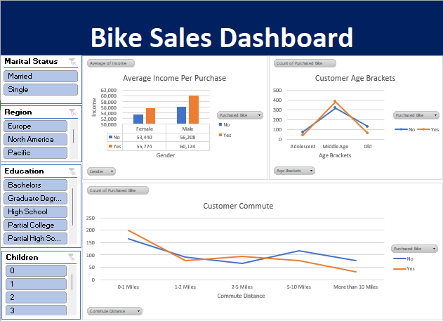

# 📊 Bike Sales Analysis Dashboard – Excel Project

## 🔍 Project Overview

This project analyzes a dataset of customer profiles to uncover patterns and insights related to bike purchases. It includes data cleaning, aggregation, and an interactive dashboard (Excel-based) to explore relationships between demographic factors and the likelihood of purchasing a bike.

---

## 📂 Project Structure

- **Raw_Data**: Original survey data with fields such as age, income, marital status, education, etc.
- **Clean_Data**: Normalized version of the raw data with enhancements (e.g., "Age Brackets").
- **Pivot_Table**: Aggregated data used to drive insights (e.g., average income by gender and purchase status).
- **Dashboard**: Interactive visuals and KPIs to support data exploration and business decisions.

---

## 📊 Dataset Overview

| Column            | Description                                 |
|-------------------|---------------------------------------------|
| ID                | Unique identifier for each customer         |
| Marital Status    | Married or Single                           |
| Gender            | Male or Female                              |
| Income            | Annual income (USD)                         |
| Children          | Number of children                          |
| Education         | Highest level of education completed        |
| Occupation        | Job category                                |
| Home Owner        | Home ownership status                       |
| Cars              | Number of cars owned                        |
| Commute Distance  | Distance to work                            |
| Region            | Geographical region (e.g., Europe, Pacific) |
| Age               | Customer's age                              |
| Age Brackets      | Derived column classifying age groups       |
| Purchased Bike    | Target variable (Yes/No)                    |

---

## 🔍 Key Insights

- **Income vs Bike Purchase**:
  - Males who purchased bikes had the highest average income (~$60,124).
  - Females also showed a positive correlation between income and bike purchases, though with a smaller gap.
  
- **Demographic Segmentation**:
  - Most bike buyers fall within the **Middle Age** bracket.
  - Higher education and professional/management occupations are common among purchasers.
  
- **Regional Trends**:
  - Bike purchases appear more prevalent in the **Pacific** and **Europe** regions.

- **Asset Influence**:
  - Bike buyers are more likely to be homeowners and own fewer cars (suggesting substitution or lifestyle choice).

---

## 🛠️  Tools & Features Used

- Microsoft Excel  
- Pivot Tables & Pivot Charts  
- Slicers & Conditional Formatting  
- Formulas: `TRIM`, `IF`, `COUNTIFS`, etc.  
- Excel Dashboard Design

---

## 📌 Note

This project is for analytical and educational purposes only
---

## 📸 Dashboard Preview

